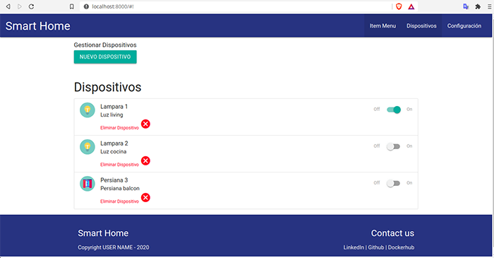
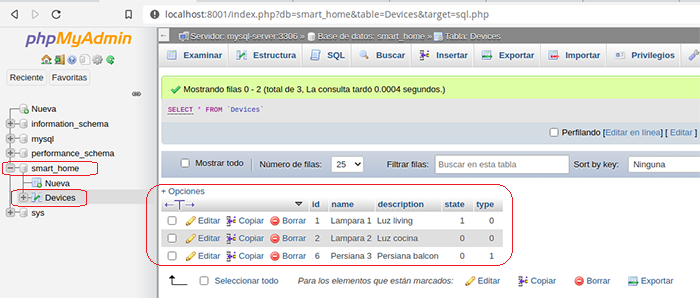
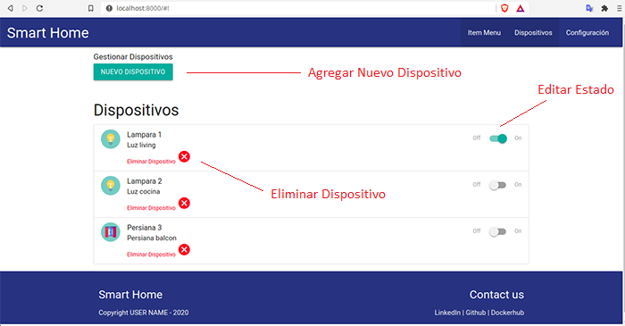
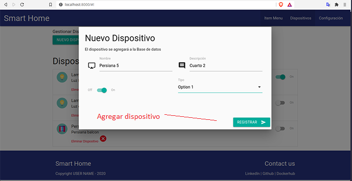

## Proyecto del curso DAW

Este proyecto permite la siguientes operaciones:
* Crear nuevos dispositivos y agregarlos a la lista.
* Editar el estado de activado o desactivado.
* Eliminar dispositivos de la lista.

Todas las operaciones tiene un efecto en la base de datos Mysql.

## Autores del proyecto
Autor:
* Ivan Cruz Flores

Docentes:

* Agustin Bassi
* Brian Ducca
* Santiago Germino

## Dashboard Principal
Vista principal de la aplicación:



## Prerequisitos para el proyecto
* Docker
* Docker-compose

## Imagenes Docker 
Se debe ejecutar las siguientes imagenes necesarias para el proyecto:
```
docker pull harmish/typescript
docker pull mysql:5.7
docker pull phpmyadmin/phpmyadmin
docker pull abassi/nodejs-server:10.0-dev
```

Para conocer más sobre la estructura interna, se puede revisar la Wiki [this link](https://github.com/ce-iot/daw-project-template/wiki).

## Instrucciones de uso
Para iniciar y levantar la aplicación se debe ejecutar:
```
docker-compose up
```
## Urls Importantes:

* Sever local para ver la aplicación: http://localhost:8000
* Server para gestión de Mysql usando PhpMyadmin: http://localhost:8001 

## Tecnologías Frontend:
* Typescript
* HTML5
* Materialize

## Tecnologías Backend:
* Node Js
* Express Js
* Mysql
## Base de datos:
Para la persistencia de datos se usa:

* Base de datos: smart_home
* Tabla: Devices

Estructura:



## Operaciones
Imagen que muestra las operaciones implementadas, cada operación tiene efecto en la base de datos.



Operación de agregar un nuevo dispositivo mediante una ventana modal.



Despues de agregar o realizar alguna acción sobre las opciones del dashboard, la lista de dispositivos se actualizará con los nuevos cambios realizados.

## Licence

This project is published under GPLV3+ licence.


